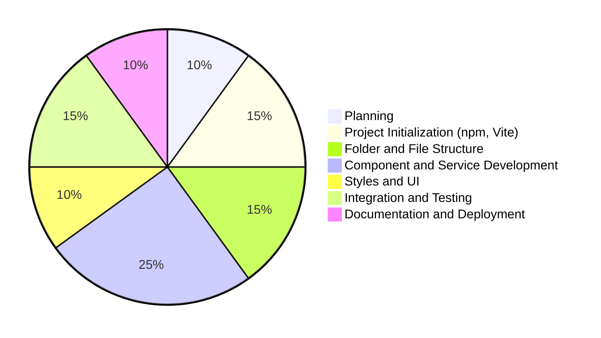
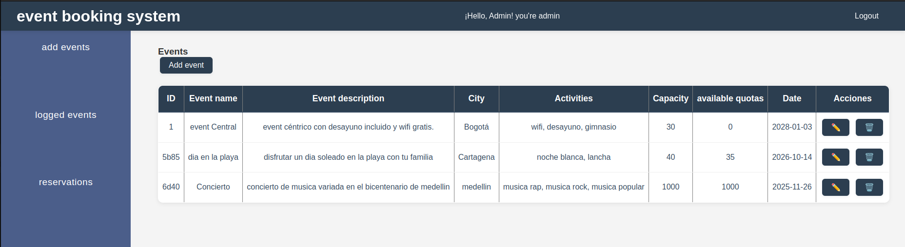
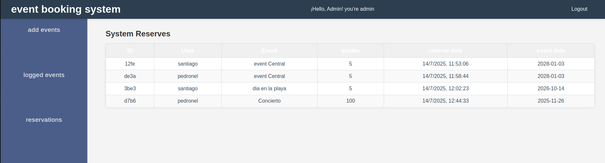
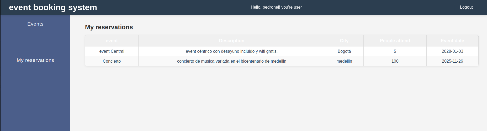

# performance test

### Developed by:
- name: Santiago Toro
- clan: lovelace
- Email: storomes@gmail.com
- cc: 1025761018

## Course and Registration System SPA

A Single Page Application (SPA) for user and course management, featuring role-based access (admin/user), dynamic navigation, and CRUD operations. Built with HTML, CSS, Vanilla JavaScript, and json-server for mock backend.

## Project Development Pie Chart


## Features
- User authentication (login/register)
- Role-based access: admin and user
- Dynamic sidebar and header
- Protected routes for admin and users
- CRUD operations for users and courses (admin only)
- Course enrollment for users
- Responsive and modern UI

## Project Structure
```
Events/
├── db.json                # Mock database for json-server
├── index.html             # Main HTML entry point
├── package.json           # Project dependencies
├── src/
│   ├── components/        # Header, sidebar, modal components
│   ├── pages/             # HTML partials for dashboard, login, register, public
│   ├── services/          # API, auth, course, enrollment, user logic
│   ├── style/             # CSS styles
│   └── utils/             # Storage and validation utilities
└── ...
```

## Installation & Setup
1. Clone the repository:
   ```bash
   git clone https://github.com/SantiagoToroMesa/simulacro-JS.git
   cd simulacro-JS
   ```
2. Install dependencies:
   ```bash
   npm install
   ```
3. Start the development server:
   ```bash
   npm run dev
   ```
4. Start the API server:
   ```bash
    json-server db.json
    ```

## Usage
- **Login/Register:** Access via `/` or `/register`.
- **Dashboard:** Admin-only, manage events and can view all the reservations.
- **Events/Public:** Users can view and enroll in Events.
- **Sidebar/Header:** Dynamic based on user role and authentication.

## Roles & Route Protection
- **Admin:** Full access to dashboard, user/course CRUD, view all enrollments.
- **User:** Can view/enroll in Event, see own enrollments.
- **Route protection** is enforced in `src/main.js`.

## Dependencies
- [json-server](https://github.com/typicode/json-server) (for mock API)
- [SweetAlert2](https://sweetalert2.github.io/) (for alerts)
- [Vite](https://vitejs.dev/) (for development server)

## Example Users
- Admin: `admin@admin.com` / `admin123`
   
   
- User:
   
