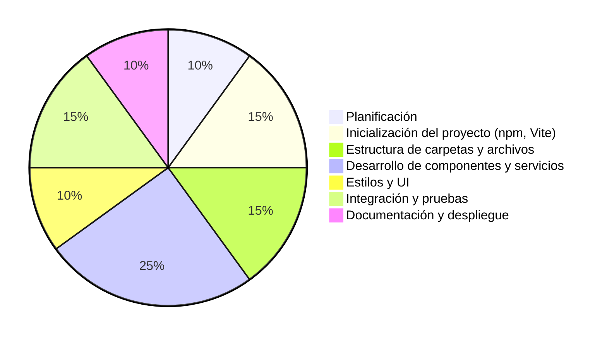

# Desarrollo de una SPA: Paso a Paso

## Diagrama de pastel del proceso

## Explicación de cada fase

1. **Planificación (10%)**  
   Define los objetivos, requisitos y roles de usuario del proyecto. Esquematiza las funcionalidades principales, los flujos de usuario y decide el stack tecnológico (por ejemplo, Vite, JS Vanilla, json-server).

2. **Inicialización del proyecto (npm, Vite) (15%)**  
   Crea la carpeta del proyecto, inicializa npm, instala Vite y configura el entorno de desarrollo. Añade los scripts esenciales en `package.json`.

3. **Estructura de carpetas y archivos (15%)**  
   Organiza el proyecto en carpetas lógicas: componentes, páginas, servicios, estilos y utilidades. Crea el HTML principal y archivos base.

4. **Desarrollo de componentes y servicios (25%)**  
   Construye componentes reutilizables (header, sidebar, modales) y servicios principales (API, autenticación, lógica CRUD). Implementa el enrutamiento y la gestión de estado.

5. **Estilos y UI (10%)**  
   Diseña y aplica CSS para una interfaz moderna, responsiva y accesible. Asegura consistencia y usabilidad en todas las vistas.

6. **Integración y pruebas (15%)**  
   Integra todos los módulos, prueba los flujos de usuario y valida las operaciones CRUD. Corrige errores, optimiza eventos y verifica la protección de rutas.

7. **Documentación y despliegue (10%)**  
   Escribe documentación clara (README, comentarios), proporciona ejemplos de uso y prepara el proyecto para despliegue o entrega. 